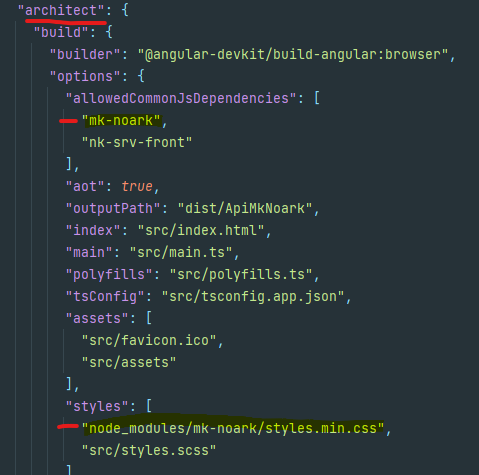

# MkNoark

`npm i mk-noark`

###Index
- [Descripción](Descripción)
- [Instalacion Basica](#Installation)
- [Documentation](#Documentation)
- [Thanks](#Thanks)

###Description
Reusable component library for angular.
This library has been developed natively without third party dependencies. Performance has been closely monitored
and performance.

With this library, a complete grid system is delivered without the need to use any other third-party library.
Icons built into the components themselves are also provided, but they can be used outside them as well.

### Installation 

#### 1. Library Installation

 `npm i mk-noark`

#### 2. Parent project settings
- In the *angular.json* file of the parent project, in the *architect/build/style* section we add the following line:
   - `node_modules/mk-noark/style.min.css`
-In the same *angular.json* file in the *architect/build/options/allowedCommonJsDependencies* section we add the line:
  - `mk-noark`
 
- Example:

 

----------------------------

### Documentation
In the following url you will find the documentation of use of all the components.
Work continues to improve the documentation:

[Go to documentation](https://david23539.github.io/doc-mk-noark/)

### Thanks

- grid : 
  - documentation: [documentation on which I base myself](https://www.toptal.com/sass/css3-flexbox-sass-grid-tutorial)
  - author:  [Juan Varela](https://www.toptal.com/resume/juan-manuel-varela)
- Formulation system with self-validation by components:
  - documentation: [url](https://rangle.io/blog/angular-2-ngmodel-and-custom-form-components/)
  - author: [Christopher Bond](https://rangle.io/blog/author/christopher-bond)
- Icons: [icoomon](https://icomoon.io/)

### Notes
The version 2.0.0 supports angular 14 but version 1.1.0 (Angular 13.X.X) is not deprecated and has all the components as the latest version
